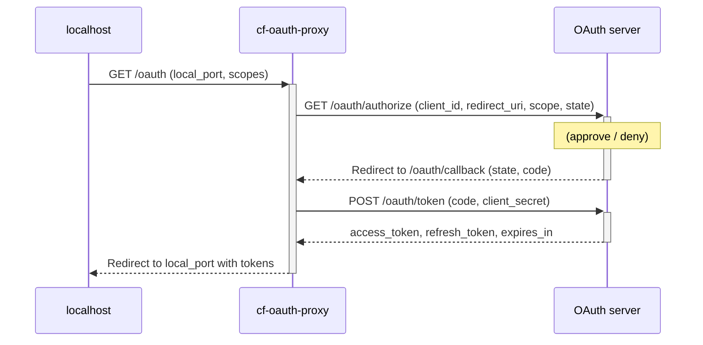

# cf-oauth-proxy

cf-oauth-proxy is a Cloudflare Worker proxy for concealing `client_secret` of your web app, while letting users get access and refresh tokens through it.

## Build

https://developers.cloudflare.com/workers/languages/rust/
